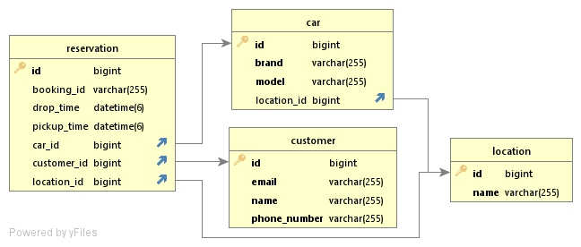

<DRAFT>

<WIP> Use case diagrams

## Database design

We have four entites here. 

1. Customer
2. Car
2. Location
4. Reservation

Reservation table has the relationships with the other tables to keep track of who booked which car at which location.

